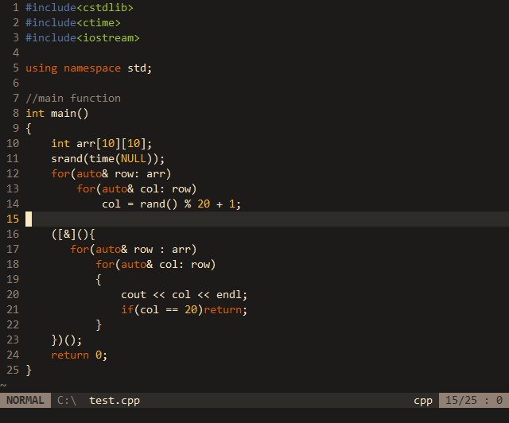
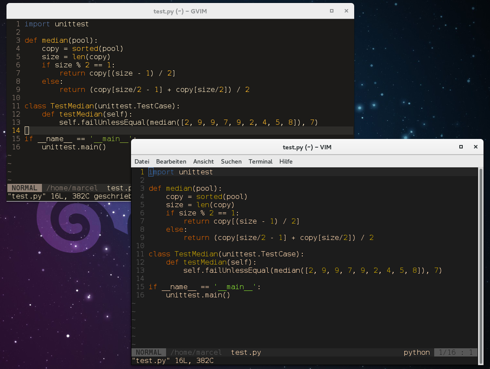
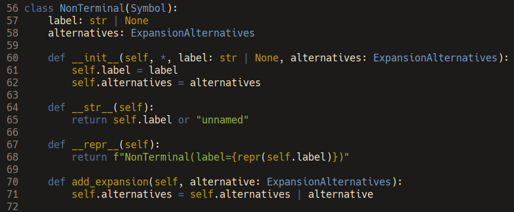

# Vorange and Voblue

A family of minimalistic dark [Vim](https://www.vim.org) and [Neovim](https://neovim.io) color schemes for GUI (true color) and terminal.
They support [nvim-treesitter](https://github.com/nvim-treesitter/nvim-treesitter)-based highlight groups.
The color family is based on [Srcery](https://github.com/roosta/vim-srcery).

[My personal homepage](http://marcelfischer.eu/)

## Screens

### Vorange





### Voblue



## Configuration

Put this in your `.vimrc` to load the Vorange / Voblue color scheme:

```vim
colorscheme vorange
"or
colorscheme voblue
```

To make the visual mode cursor work as intended put this in your `.vimrc`.
The cursor should stop blinking and the selection should look like a 'long' cursor.

```vim
set guicursor+=v:vCursor
```


This color scheme can be configured by setting global variables before loading.

```vim
"disable italics
let g:vorange_italic = 0

"disable bold
let g:vorange_bold = 0

"disable underline
let g:vorange_underline=0

"disable undercurl
let g:vorange_undercurl=0
```

(replace `vorange_` with `voblue_` for Voblue configuration)

Currently, color inversion cannot be disabled. Because of the lack of fallback this would make the cursor and visual mode invisible.

## Airline Theme

A fitting [Airline](https://github.com/vim-airline/vim-airline) theme is included! To activate, put this in your `.vimrc`:

```vim
let g:airline_theme="vorange"
```

